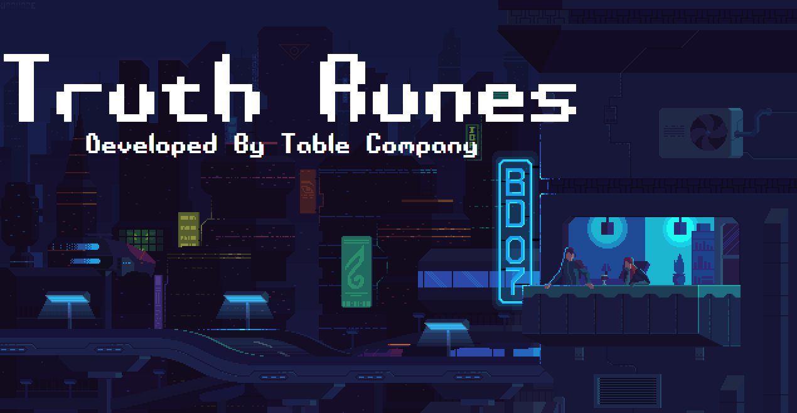

<body>
	

		
	

</body>
+=+=+=+=+=+=+=+=+=+=+=+=+=+=+=+=+=+=+=+=+=+=+=+=+=+=+=+=+=+=+=+=+

--- TRUTH RUNES ---
--- TABLE COMPANY PRODUCTIONS ---	               
--- A Game App Project --- 	            
_____________________________________________________________

This Game Application is called “Truth Runes” that tackles the “truth table” topic. It is an executable file that when clicked, takes the user to the Title screen of the game. The game’s concept/theme is ‘retro runic with a mix of cyberpunk’. The Table Company team decided to design the game with a retro aesthetic vibe. The ‘runes’ represent the different logical operators and propositional variables. The programming language that we used is Java and the integrated development environment (IDE) for Java is Apache NetBeans through Jframe form. Aside from being a game app, Truth Runes also has a built-in truth table generator which allows users to construct truth tables based on the given propositional equation by the users.

The nature of the game is educational, and its purpose is to teach the user and familiarize them with the truth table, Boolean concept and true/false values. Specifically, the application is a quiz game which means that it tests the user’s overall knowledge about propositional logic. The game allows players to select their preferred difficulty levels base on the user’s mastery of the topic. Another function of the game is its ability to store previous playthroughs of the user’s and their time of completion.

(Before reading this please enable "Word wrap" in View setting)

This game is created by a group of student:
----Game Requirements: 
- Latest version of Java (Java Runtime Environment)
- Latest version JDK (Java Development Kit) 
- Alkhemikal font.tff
- Æ Systematic TT BRK Font.tff

In order to run this game properly you must install the following:
(Don't worry , this won't take too long)

---All files can be located inside the dist Folder
- Image/font/Alkhemikal.tff  (for font style) 
- Image/font/AE Systematic.tff  (for font style)
- JDK 13.0.1 (Just click and install)

---To update Java (Java Runtime Environment):
- Go to start menu
- Select Configure java
- Go to update pane and update your java

//You can also download java at https://www.java.com/en/download/

-------After installing JDK 13.0.1 you must do the following to ensure that the app will work properly:
- Go to start menu
- Select Configure java
- Go to Java pane and select "View"
- Click Add
- After clicking add, click find (Select empty slot)
- JRE finder will pop-up, just click next
- Find the file directory of your installed JDK 13.0.1 (Usually located at C:/Program Files/Java/)
- Select jdk-13.0.1 and select next then click finish after

---HOW TO PLAY---
-To play the game, just simply run Truth Rune.exe 
-Select "Start" 
-choose difficulty 
-You can check your score history in the score button that can
be located in the Main menu.

< - >< - >< - >< - >< - >< - >< - >< - >< - >< - >< - >< - >< - >
 		
			~^ GAME CONTENT v->

- The game starts with the Title page then proceeds to the main menu upon clicking anywhere on the screen.  There are four buttons in the main menu with different functions.

START
 	The first button Is the “Start” button that when clicked, proceeds to the difficulty menu where the user can choose the difficulty which ranges from easy, medium and hard mode. After the user chooses their preferred difficulty, they will be taken to a screen which requires them to answer the given quiz by typing ‘T’ or ‘F’ regardless of the letter’s case. When the user is done, they must click the finish button to end the quiz that proceeds to the result screen. The result screen shows the outcome of the user’s answers and their time of completion. If the user is not satisfied with the results, they can retake the quiz by clicking the “Try Again” button.

-TUTORIAL-
	The second button in the main menu is the “Tutorial” button where the user can learn and familiarize themselves regarding propositional logic and the rules of the game. 

-GENERATOR-
	The third button in the main menu is the “Generator” button menu which takes the user to a truth table generating screen that creates truth tables based on the user’s inputted propositional equation. This is achieved by clicking the “Generate Rune” button after typing the propositional equation in the text field provided.

-SCORES-
	Last but not the least is the “Scores” button. When pressed, reveals the history of the user’s preceding game results. Each difficulty has its own stored results of history. There is no maximum amount of stored gameplay. Every screen except the title page and main menu have back button characterized by the less than symbol ‘<’. 

+=+=+=+=+=+=+=+=+=+=+=+=+=+=+=+=+=+=+=+=+=+=+=+=+=+=+=+=+=+=+=+=+
